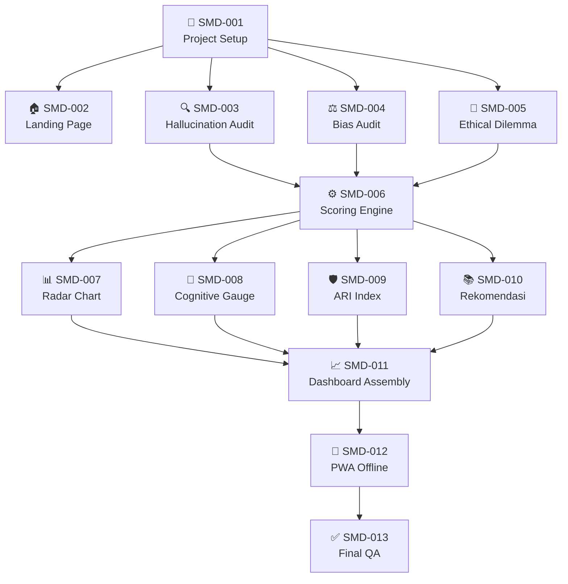

# 📋 SONAR MIND Dashboard — Ticket Index

> **Project:** SONAR MIND Dashboard — Hackathon UNESCO 2026  
> **Stack:** Next.js 16 · React 19 · TypeScript · Tailwind CSS 4  
> **Sprint:** MVP 14 Hari · **Total Estimasi:** ~40 jam  
> **Tanggal:** Agustus 2026

---

## Dependency Graph



---

## Daftar Ticket

### 📁 `00-epic/` — Epic
| ID | Ticket | File |
|:---|:-------|:-----|
| EPIC-001 | SONAR MIND Dashboard — MVP Build | [EPIC-001-sonar-mind-dashboard.md](./00-epic/EPIC-001-sonar-mind-dashboard.md) |

---

### 📁 `01-setup/` — Foundation & Design System
| ID | Ticket | Blocked By | Est. |
|:---|:-------|:-----------|:-----|
| SMD-001 | Project Setup & Design System | — | 3h |

📄 [SMD-001-project-setup-design-system.md](./01-setup/SMD-001-project-setup-design-system.md)

---

### 📁 `02-pages/` — Halaman Statis
| ID | Ticket | Blocked By | Est. |
|:---|:-------|:-----------|:-----|
| SMD-002 | Landing Page & Navigation | SMD-001 | 4h |

📄 [SMD-002-landing-page-navigation.md](./02-pages/SMD-002-landing-page-navigation.md)

---

### 📁 `03-sandbox/` — Modul Simulasi Interaktif (Sonar Mind Sandbox)
| ID | Ticket | Pilar | Blocked By | Est. |
|:---|:-------|:------|:-----------|:-----|
| SMD-003 | Hallucination & Fact-Checking Audit | P1: Critical Evaluation (30%) | SMD-001 | 4h |
| SMD-004 | Algorithmic Bias & Cultural Audit | P2: Bias Awareness (25%) | SMD-001 | 4h |
| SMD-005 | Ethical Dilemma & Cognitive Agency | P3+P4: Ethics (25%) + Agency (20%) | SMD-001 | 4h |

📄 [SMD-003-hallucination-fact-checking-audit.md](./03-sandbox/SMD-003-hallucination-fact-checking-audit.md)  
📄 [SMD-004-algorithmic-bias-cultural-audit.md](./03-sandbox/SMD-004-algorithmic-bias-cultural-audit.md)  
📄 [SMD-005-ethical-dilemma-cognitive-agency.md](./03-sandbox/SMD-005-ethical-dilemma-cognitive-agency.md)

---

### 📁 `04-engine/` — Scoring Engine
| ID | Ticket | Blocked By | Est. |
|:---|:-------|:-----------|:-----|
| SMD-006 | Scoring Engine (4 Pilar Rubrik) | SMD-003, SMD-004, SMD-005 | 3h |

📄 [SMD-006-scoring-engine.md](./04-engine/SMD-006-scoring-engine.md)

---

### 📁 `05-dashboard/` — Visualisasi Dashboard (Sonar Pulse)
| ID | Ticket | Fitur | Blocked By | Est. |
|:---|:-------|:------|:-----------|:-----|
| SMD-007 | Radar Chart 4 Pilar Kompetensi | Fitur 4 | SMD-006 | 3h |
| SMD-008 | Cognitive Agency Ratio Indicator | Fitur 5 | SMD-006 | 2h |
| SMD-009 | Algorithmic Resilience Index (ARI) | Fitur 6 | SMD-006 | 2h |
| SMD-010 | Rekomendasi Modul Belajar Otomatis | Fitur 7 | SMD-006 | 2h |
| SMD-011 | Sonar Pulse Dashboard Assembly | — | SMD-007–010 | 3h |

📄 [SMD-007-radar-chart-4-pilar.md](./05-dashboard/SMD-007-radar-chart-4-pilar.md)  
📄 [SMD-008-cognitive-agency-ratio.md](./05-dashboard/SMD-008-cognitive-agency-ratio.md)  
📄 [SMD-009-algorithmic-resilience-index.md](./05-dashboard/SMD-009-algorithmic-resilience-index.md)  
📄 [SMD-010-rekomendasi-modul-belajar.md](./05-dashboard/SMD-010-rekomendasi-modul-belajar.md)  
📄 [SMD-011-sonar-pulse-dashboard-assembly.md](./05-dashboard/SMD-011-sonar-pulse-dashboard-assembly.md)

---

### 📁 `06-infrastructure/` — PWA & Offline
| ID | Ticket | Blocked By | Est. |
|:---|:-------|:-----------|:-----|
| SMD-012 | PWA & Offline-Ready Architecture | SMD-011 | 3h |

📄 [SMD-012-pwa-offline-ready.md](./06-infrastructure/SMD-012-pwa-offline-ready.md)

---

### 📁 `07-qa/` — Quality Assurance & Polish
| ID | Ticket | Blocked By | Est. |
|:---|:-------|:-----------|:-----|
| SMD-013 | Responsive Polish & Final QA | SMD-012 | 3h |

📄 [SMD-013-responsive-polish-final-qa.md](./07-qa/SMD-013-responsive-polish-final-qa.md)

---

## Ringkasan Estimasi per Fase

| Fase | Folder | Tickets | Total Jam |
|:-----|:-------|:--------|:----------|
| Foundation | `01-setup/` | 1 | 3h |
| Pages | `02-pages/` | 1 | 4h |
| Sandbox | `03-sandbox/` | 3 | 12h |
| Engine | `04-engine/` | 1 | 3h |
| Dashboard | `05-dashboard/` | 5 | 12h |
| Infrastructure | `06-infrastructure/` | 1 | 3h |
| QA | `07-qa/` | 1 | 3h |
| **TOTAL** | | **13** | **~40h** |

---

## Urutan Eksekusi Optimal

```
Hari 1–2    → SMD-001 (Setup)
Hari 2–3    → SMD-002 (Landing) + SMD-003/004/005 (Sandbox — paralel)
Hari 4–5    → SMD-006 (Scoring Engine)
Hari 6–8    → SMD-007/008/009/010 (Dashboard Widgets — paralel)
Hari 9–10   → SMD-011 (Dashboard Assembly)
Hari 11–12  → SMD-012 (PWA)
Hari 13–14  → SMD-013 (Final QA & Polish)
```
